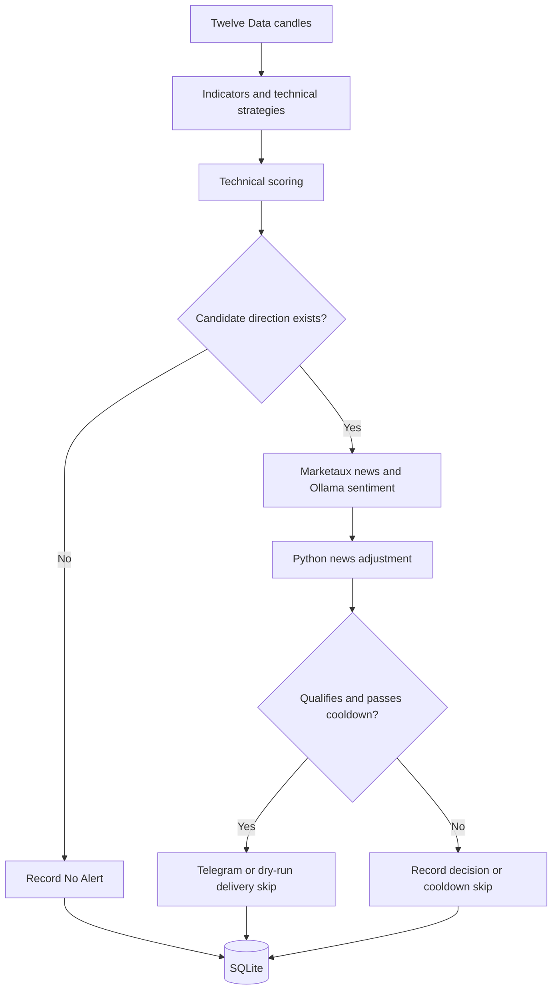

# Forex Alert Bot

[](https://github.com/kareemnasir/forex-alert-bot/actions/workflows/ci.yml)

A Python service that watches forex setups, adds news context, and sends explainable Telegram alerts. Every decision has a recorded trail: the technical signals, score changes, and reason an alert was sent or skipped.

Built for manual review. The bot has no broker connection and does not place trades.

## Why this project

Forex monitoring involves checking price setups alongside news that may support or contradict them. This project brings those inputs into one alert and makes the reasoning available for review.

The focus is on explainability: each alert should show which rules matched, how news affected the score, and what would invalidate the setup. Recording quiet runs, provider failures, and suppressed duplicates makes it possible to investigate the system's behavior as well as its output.

## What it does

- Monitors **EUR/USD, GBP/USD, and USD/JPY** on **15-minute and 1-hour** candles by default.
- Evaluates trend pullbacks, range breakouts, and mean reversion with deterministic Python rules.
- Scores agreement and conflict between strategies, then applies bounded news adjustments.
- Sends qualifying alerts through Telegram and suppresses repeated alerts during a configurable cooldown.
- Stores runs, decisions, news analyses, delivery outcomes, and errors in SQLite for inspection.

## Example alert

Illustrative output using the bot's message format. This is not a captured live signal or a trading result.

```text
EUR/USD BUY Watch
Timeframe: 15min
Score: 70/100
Strategies: Trend Pullback
Reasons: News sentiment was unavailable; technical score was unchanged.; trend-pullback: Higher-timeframe EMA 50 is above EMA 200.; trend-pullback: Lower-timeframe price pulled back near EMA 20/50.
Invalidation: below 1.0820
Manual decision only.
```

A run with no qualifying setup records **No Alert** and sends no message. The bot does not send a heartbeat every half hour.

## How decisions work



Only the technical strategies can create candidates. Ollama analyzes supplied news; Python validates its output and applies score adjustments. News cannot turn a rejected technical decision into an alert. If news is unavailable, an otherwise qualifying technical alert can still be sent with that limitation in its explanation.

The default schedule checks every half hour between 7 AM and 10 PM in `America/Detroit`, within an approximate Sunday-evening-to-Friday-evening forex week. Holidays and exceptional market closures are not modeled.

## Project status

As verified on **September 10, 2026**:

- Deployed on Debian 13 / DigitalOcean as an enabled systemd service; live Telegram delivery is configured.
- Natural live scheduled Runs 5 and 6 completed with zero recorded errors and No Alert outcomes, most recently at 3:30 PM Detroit.
- Real-provider checks passed for candles, news retrieval, and structured sentiment; a Telegram connectivity test was accepted.
- **337 tests passed** locally and on Debian, along with lint and formatting checks. Reboot startup, bounded restarts, backup/restore, and rollback were exercised.

The first naturally qualifying setup reaching Telegram has **not yet been verified** in the recorded evidence. The project has no backtesting or demonstrated profitability claim. See the [verification record](docs/issue-30-deployment-verification.md) for dated results and limitations.

## Run locally

Requires Python 3.12+ and provider credentials. Start with dry-run mode, which uses real providers but suppresses Telegram delivery.

```bash
python3 -m venv .venv
source .venv/bin/activate
pip install -r requirements.txt -r requirements-dev.txt
cp .env.example .env
```

Fill in the credentials and model in `.env`, then run and inspect one check:

```bash
python -m forex_alert_bot --run-once --dry-run
python -m forex_alert_bot --inspect-recent
```

Market data is required to generate candidates. News and Ollama are called only when relevant candidates and articles exist. Inspect the error count as well as the run status: recoverable provider failures can occur in a completed run.

## Development

```bash
python -m pytest
ruff check .
ruff format --check .
```

Tests use temporary databases and guard the default runtime database against modification. Production installation uses hash-locked dependencies; see the deployment guide.

## Documentation

- [Setup, configuration, and CLI commands](docs/usage.md)
- [Architecture and scoring rules](docs/project-context.md)
- [Deployment and recovery](docs/vps-deployment.md)
- [Deployment verification](docs/issue-30-deployment-verification.md)
- [Implementation milestones and remaining limitations](docs/issue-plan.md)
- [Domain terminology](CONTEXT.md)
